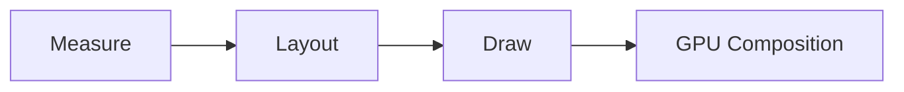
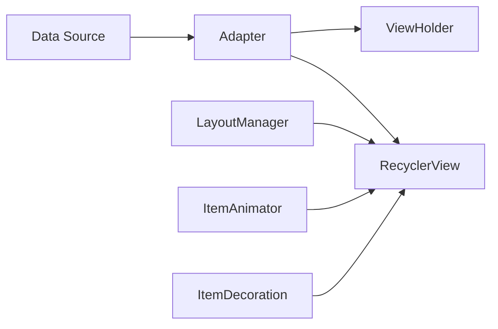
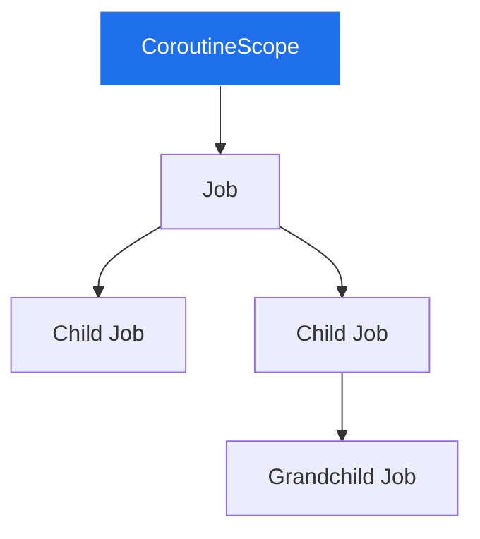
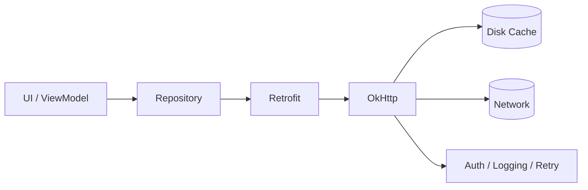
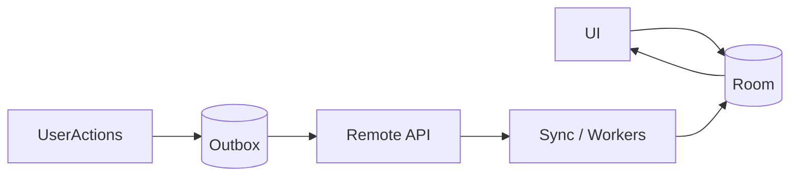
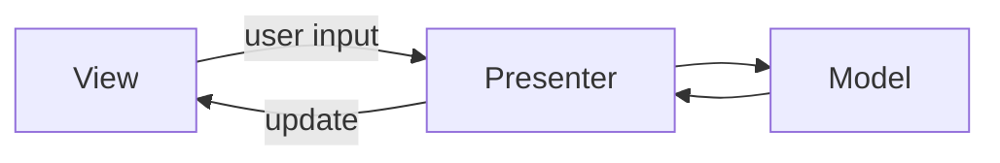
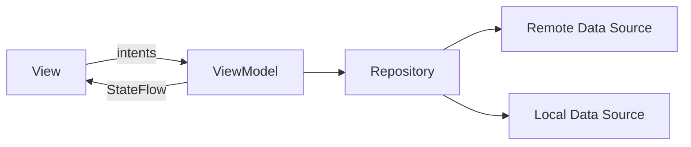
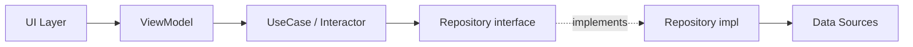

# Android Archives

> This is my personal Android archives — the place where I store the research I use to **interview Android developers, mentor engineers, and grow as an Engineering Manager**.
>
> It started as a flashcard-style reference. Over time it has grown into a **practical, opinionated Android engineering knowledge base**: deep enough to prepare a senior engineer for a system-design interview, broad enough for an EM to evaluate candidates, and modern enough to reflect how high-performing Android teams actually build apps today.

---

## Table of Contents

- [Android Archives](#android-archives)
  - [How to Use This Repository](#how-to-use-this-repository)
  - [Android Layouts](#android-layouts)
    - [RelativeLayout](#relativelayout)
    - [LinearLayout](#linearlayout)
    - [FrameLayout](#framelayout)
    - [ConstraintLayout](#constraintlayout)
    - [RecyclerView](#recyclerview)
    - [ViewPager / ViewPager2](#viewpager--viewpager2)
    - [Animations](#animations)
    - [Layout Performance Cheat Sheet](#layout-performance-cheat-sheet)
  - [Android Data and Networking](#android-data-and-networking)
    - [Saving Data on Android](#saving-data-on-android)
    - [Kotlin Coroutines](#kotlin-coroutines)
    - [Room Database](#room-database)
    - [Android Networking](#android-networking)
    - [Background Processing](#background-processing)
  - [Architecture](#architecture)
    - [MVC](#mvc)
    - [MVP](#mvp)
    - [VIPER](#viper)
    - [MVVM](#mvvm)
    - [Architecture Comparison Table](#architecture-comparison-table)
  - [MVVM Deep Dive](#mvvm-deep-dive)
  - [Dependency Injection](#dependency-injection)
  - [Room Persistence (Deep Dive)](#room-persistence-deep-dive)
  - [Modern Android Development](#modern-android-development)
  - [Engineering Management Perspective](#engineering-management-perspective)
  - [Suggested Folder Structure](#suggested-folder-structure)
  - [Roadmap](#roadmap)
  - [Advanced Topics to Add Later](#advanced-topics-to-add-later)
  - [Interview Question Bank](#interview-question-bank)

---

## How to Use This Repository

This repo is structured so that you can:

- **Skim it as a glossary** during an interview cycle (each section starts with a definition and pros/cons).
- **Read it linearly** as a learning path, starting from layouts, going through data & networking, then architecture, and finally engineering management concerns.
- **Use the [Interview Question Bank](#interview-question-bank)** to dry-run a real interview loop with junior, mid-level, and senior expectations.

Three audiences are addressed throughout:

1. **Mid-level Android developers** preparing for senior interviews.
2. **Senior Android engineers** brushing up on architecture, performance, and modern Compose-based stacks.
3. **Engineering Managers** who need to evaluate, hire, and grow Android engineers.

Tone: practical, opinionated, and biased toward how teams actually ship at scale — not just toward what is documented in `developer.android.com`.

---

# Android

## Android Layouts

Layout choice is one of the most under-estimated decisions in Android. It affects:

- **Rendering performance** (overdraw, measure/layout passes).
- **Accessibility** (focus order, semantics).
- **Maintainability** (deep view hierarchies = bugs).
- **Animation feasibility** (some layouts make shared-element transitions trivial, others make them painful).

Modern Android UIs are gradually moving to **Jetpack Compose**, but the View system still powers the majority of production apps as of 2026. A staff-level engineer should be fluent in both.

### Rendering Mental Model

Every `View` goes through three phases on each frame it changes:



- **Measure** — parent asks each child for its desired size given constraints.
- **Layout** — parent places children at coordinates.
- **Draw** — view records draw commands into a `DisplayList`; the GPU composes them.

Deeply nested layouts can cause **multiple measure passes** (especially `RelativeLayout` and weighted `LinearLayout`). The cost is `O(children × passes)`, which is why `ConstraintLayout` was introduced.

---

### RelativeLayout

**Definition.** A `ViewGroup` where child views are positioned **relative to each other** or to the parent (e.g., `layout_below`, `layout_toRightOf`, `layout_alignParentEnd`).

**Purpose.** Avoid deep nesting that `LinearLayout` chains require, by expressing positional relationships declaratively.

**Pros**

- Flat hierarchies were possible long before `ConstraintLayout`.
- Conceptually simple for small layouts.

**Cons**

- Performs **two measure passes** because constraints can reference siblings whose size is not yet known.
- Easy to create accidental circular dependencies (`A toRightOf B`, `B toRightOf A`).
- Poor support for weights/chains compared to `ConstraintLayout`.
- Largely **deprecated in modern apps** in favor of `ConstraintLayout`.

**XML example**

```xml
<RelativeLayout
    xmlns:android="http://schemas.android.com/apk/res/android"
    android:layout_width="match_parent"
    android:layout_height="wrap_content">

    <ImageView
        android:id="@+id/avatar"
        android:layout_width="48dp"
        android:layout_height="48dp"
        android:layout_alignParentStart="true" />

    <TextView
        android:id="@+id/title"
        android:layout_width="wrap_content"
        android:layout_height="wrap_content"
        android:layout_toEndOf="@id/avatar"
        android:layout_alignTop="@id/avatar" />

    <TextView
        android:id="@+id/subtitle"
        android:layout_width="wrap_content"
        android:layout_height="wrap_content"
        android:layout_toEndOf="@id/avatar"
        android:layout_below="@id/title" />
</RelativeLayout>
```

**Common interview questions**

- Why is `RelativeLayout` discouraged today?
- How many measure passes does it run, and why?
- How would you migrate a screen built with `RelativeLayout` to `ConstraintLayout`?

**Compose equivalent.** `ConstraintLayout` (in Compose), or more idiomatically a combination of `Row`, `Column`, and `Box`.

---

### LinearLayout

**Definition.** A `ViewGroup` that arranges children in a single direction (`vertical` or `horizontal`).

**Purpose.** The simplest way to stack content. Best for short lists of items, toolbars, form fields.

**Pros**

- Predictable, easy to reason about.
- Cheap when **no weights** are used (single measure pass).
- Great for very small UI fragments.

**Cons**

- **Weights cost a second measure pass**: the layout first measures all unweighted children, then distributes remaining space.
- Deep nesting (the "matryoshka anti-pattern") leads to dozens of measure passes per frame.
- No support for relative or chained positioning.

**XML example with weights**

```xml
<LinearLayout
    android:layout_width="match_parent"
    android:layout_height="wrap_content"
    android:orientation="horizontal"
    android:weightSum="3">

    <Button
        android:layout_width="0dp"
        android:layout_height="wrap_content"
        android:layout_weight="1"
        android:text="Cancel" />

    <Button
        android:layout_width="0dp"
        android:layout_height="wrap_content"
        android:layout_weight="2"
        android:text="Confirm" />
</LinearLayout>
```

**Performance tip.** If you need weighted layouts, prefer `ConstraintLayout` with **chains** (`packed`, `spread`, `spread_inside`) — it achieves the same result in a single pass.

**Common interview questions**

- When does `LinearLayout` trigger two measure passes?
- What's the difference between `weight` and `weightSum`?
- Why is `<merge>` useful with `LinearLayout`-based custom views?

**Compose equivalent.** `Column` (vertical) and `Row` (horizontal) with `Modifier.weight(...)`.

---

### FrameLayout

**Definition.** A `ViewGroup` designed to display a **single child view**, or to stack children on top of each other in z-order.

**Purpose.** Commonly used as a **fragment container**, an overlay host, or for simple "card on background" UIs.

**Pros**

- Extremely lightweight — single measure/layout pass for typical use.
- Perfect host for `FragmentTransaction.replace(R.id.container, ...)`.

**Cons**

- Limited layout capabilities — anything beyond stacking gets ugly fast.

**XML example**

```xml
<FrameLayout
    android:id="@+id/container"
    android:layout_width="match_parent"
    android:layout_height="match_parent">

    <ImageView
        android:layout_width="match_parent"
        android:layout_height="match_parent"
        android:scaleType="centerCrop"
        android:src="@drawable/hero" />

    <TextView
        android:layout_width="wrap_content"
        android:layout_height="wrap_content"
        android:layout_gravity="bottom|start"
        android:padding="16dp"
        android:textColor="@android:color/white"
        android:text="Welcome" />
</FrameLayout>
```

**Common interview questions**

- Why is `FrameLayout` the preferred container for fragments?
- How does `layout_gravity` differ from `gravity`?

**Compose equivalent.** `Box`.

---

### ConstraintLayout

**Definition.** A flat, flexible `ViewGroup` introduced in 2016 that lets you express positional constraints between siblings and the parent without nesting.

**Purpose.** Build complex, flat hierarchies that **measure in a single pass** and are easy to animate via `MotionLayout` or `TransitionManager`.

**Pros**

- Flat hierarchy → fewer measure/layout passes → smoother frames.
- Chains, barriers, groups, guidelines, and `Flow` virtual helpers.
- First-class support in Android Studio's layout editor.
- Plays nicely with `MotionLayout` for keyframe animations.

**Cons**

- Verbose XML — constraint attributes pile up.
- A learning curve for chains, barriers, and bias.
- Performance can regress if you accidentally create **chains within chains** or overuse `0dp` `match_constraint` with `wrap_content` siblings.

**XML example**

```xml
<androidx.constraintlayout.widget.ConstraintLayout
    xmlns:android="http://schemas.android.com/apk/res/android"
    xmlns:app="http://schemas.android.com/apk/res-auto"
    android:layout_width="match_parent"
    android:layout_height="wrap_content">

    <ImageView
        android:id="@+id/avatar"
        android:layout_width="48dp"
        android:layout_height="48dp"
        app:layout_constraintStart_toStartOf="parent"
        app:layout_constraintTop_toTopOf="parent" />

    <TextView
        android:id="@+id/title"
        android:layout_width="0dp"
        android:layout_height="wrap_content"
        app:layout_constraintStart_toEndOf="@id/avatar"
        app:layout_constraintTop_toTopOf="@id/avatar"
        app:layout_constraintEnd_toEndOf="parent" />

    <TextView
        android:id="@+id/subtitle"
        android:layout_width="0dp"
        android:layout_height="wrap_content"
        app:layout_constraintStart_toStartOf="@id/title"
        app:layout_constraintTop_toBottomOf="@id/title"
        app:layout_constraintEnd_toEndOf="parent" />
</androidx.constraintlayout.widget.ConstraintLayout>
```

**Performance considerations**

- Use `Barrier` instead of measuring against the largest sibling manually.
- Use `Group` to toggle visibility of multiple views in one call.
- Prefer `0dp` (`match_constraint`) over `wrap_content` when you want the constraint system to optimize layout.

**Common interview questions**

- Why does `ConstraintLayout` outperform deeply nested `LinearLayout`s?
- What is a `Barrier`? When would you choose it over `Guideline`?
- Explain chains: `spread`, `spread_inside`, `packed`.
- What is `MotionLayout` and when would you avoid it?

**Compose equivalent.** Often replaced by `Row`/`Column`/`Box`, but `ConstraintLayout` for Compose exists for screens with truly complex relative positioning.

---

### RecyclerView

**Definition.** A flexible view container that **recycles** off-screen item views to render large data sets efficiently.

**Purpose.** Replace `ListView`/`GridView`. The de-facto solution for any scrollable list since 2014.

**Architecture**



**Core components**

- **Adapter** — bridges data to `ViewHolder`s.
- **ViewHolder** — caches view references for an item.
- **LayoutManager** — decides how items are laid out (`LinearLayoutManager`, `GridLayoutManager`, `StaggeredGridLayoutManager`).
- **ItemDecoration** — dividers, spacing, sticky headers.
- **ItemAnimator** — animations on insert/remove/move/change.
- **DiffUtil / ListAdapter** — efficient list diffing on a background thread.

**Pros**

- Recycles views → constant memory usage.
- Decoupled layout strategy (swap `LayoutManager`).
- First-class support for animations and diffing.
- Works well with paging via `Paging 3` library.

**Cons**

- More boilerplate than `ListView`.
- Easy to misuse: `notifyDataSetChanged()` instead of `DiffUtil`, heavy work in `onBindViewHolder`, holding `Context` references in adapters.

**ListAdapter with DiffUtil (modern pattern)**

```kotlin
class UserAdapter : ListAdapter<User, UserViewHolder>(UserDiff) {

    override fun onCreateViewHolder(parent: ViewGroup, viewType: Int): UserViewHolder {
        val binding = ItemUserBinding.inflate(LayoutInflater.from(parent.context), parent, false)
        return UserViewHolder(binding)
    }

    override fun onBindViewHolder(holder: UserViewHolder, position: Int) {
        holder.bind(getItem(position))
    }

    object UserDiff : DiffUtil.ItemCallback<User>() {
        override fun areItemsTheSame(old: User, new: User) = old.id == new.id
        override fun areContentsTheSame(old: User, new: User) = old == new
    }
}
```

**Performance pitfalls and best practices**

- Set `recyclerView.setHasFixedSize(true)` if your list's overall size doesn't depend on the adapter contents.
- Use `RecycledViewPool` to share view holders between multiple `RecyclerView`s (e.g., horizontal lists inside a vertical feed).
- Avoid inflating layouts in `onBindViewHolder`.
- Use `payloads` in `DiffUtil` for partial bindings (e.g., updating a "like" count without re-binding the whole row).
- Pre-fetch via `LinearLayoutManager.setInitialPrefetchItemCount` for nested horizontal lists.
- Use `ConcatAdapter` to compose multiple adapters into one list (headers, footers, ads).

**Common interview questions**

- How does view recycling actually work? What's the role of `RecycledViewPool`?
- Compare `DiffUtil` vs `notifyDataSetChanged()`. When is one preferable?
- How would you implement an infinite-scroll feed?
- How do you efficiently render heterogeneous item types?
- What problems does `Paging 3` solve, and how does it integrate with Flow?

**Compose equivalent.** `LazyColumn`, `LazyRow`, `LazyVerticalGrid`. They use `key` for stable identity (the Compose equivalent of `DiffUtil` keys) and a `LazyListState` for scroll control. The mental model is simpler but the same recycling concept applies (active composition reuse).

---

### ViewPager / ViewPager2

**Definition.** A horizontally swipeable container. `ViewPager2` is the modern, `RecyclerView`-based reimplementation that supports vertical paging, RTL, fragments via `FragmentStateAdapter`, and `DiffUtil`.

**Purpose.** Onboarding carousels, swipeable tabs (with `TabLayout`), image galleries.

**Pros (ViewPager2 vs ViewPager)**

- Built on `RecyclerView` (familiar, performant).
- Supports vertical orientation.
- Right-to-left support.
- `DiffUtil`-friendly adapters.
- Programmatic scrolling via `setCurrentItem(position, smoothScroll)`.

**XML and Kotlin example**

```xml
<androidx.viewpager2.widget.ViewPager2
    android:id="@+id/pager"
    android:layout_width="match_parent"
    android:layout_height="match_parent" />
```

```kotlin
class TabsAdapter(activity: FragmentActivity) : FragmentStateAdapter(activity) {
    override fun getItemCount(): Int = 3
    override fun createFragment(position: Int): Fragment = when (position) {
        0 -> HomeFragment()
        1 -> SearchFragment()
        else -> ProfileFragment()
    }
}

pager.adapter = TabsAdapter(this)
TabLayoutMediator(tabLayout, pager) { tab, position ->
    tab.text = listOf("Home", "Search", "Profile")[position]
}.attach()
```

**Performance considerations**

- `offscreenPageLimit` controls how many adjacent pages are kept hydrated; raising it helps perceived smoothness but increases memory.
- For deep object pages, prefer `FragmentStateAdapter` (destroys/recreates fragments) over `FragmentPagerAdapter`.

**Common interview questions**

- Why did `ViewPager2` replace `ViewPager`?
- How do you keep state when the user swipes between fragments?
- How do you implement a parallax page effect (`PageTransformer`)?

**Compose equivalent.** `HorizontalPager` and `VerticalPager` from `androidx.compose.foundation.pager`, paired with `PagerState` and `pagerTabIndicatorOffset` for tabs.

---

### Animations

Android has **five** distinct animation systems. Knowing which one to reach for is itself a senior signal.

| System | Best for | Notes |
| --- | --- | --- |
| **View animations** (`Animation`, `AnimationUtils`) | Legacy, simple translate/scale | Doesn't update actual view properties |
| **Property animations** (`ObjectAnimator`, `ValueAnimator`, `ViewPropertyAnimator`) | Modern way to animate properties | Updates real properties, integrates with `Transition` |
| **Transition framework** (`TransitionManager`, `Scene`) | Coordinated layout changes | Useful for shared-element transitions |
| **MotionLayout** | Keyframe-style choreography | Declarative, lives in XML, great for collapsing toolbars |
| **Compose animations** | All Compose UI | Built around `Animatable`, `animate*AsState`, `AnimatedVisibility`, `updateTransition` |

**Property animation example**

```kotlin
view.animate()
    .alpha(0f)
    .translationY(-40f)
    .setDuration(250)
    .setInterpolator(FastOutSlowInInterpolator())
    .withEndAction { view.isVisible = false }
    .start()
```

**Shared-element transition (Activity → Activity)**

```kotlin
val options = ActivityOptionsCompat.makeSceneTransitionAnimation(
    this, imageView, "hero_image"
)
startActivity(intent, options.toBundle())
```

**Compose animation example**

```kotlin
val expanded by remember { mutableStateOf(false) }
val height by animateDpAsState(if (expanded) 320.dp else 120.dp, label = "card-height")
Card(modifier = Modifier.fillMaxWidth().height(height)) { /* ... */ }
```

**Performance considerations**

- Always prefer **hardware-accelerated properties** (`alpha`, `translationX/Y`, `rotation`, `scaleX/Y`) — they avoid invalidation.
- Avoid animating layout-changing properties (`width`, `height`, `padding`) on every frame; use `scale` or `MotionLayout` keyframes instead.
- Use `Choreographer.postFrameCallback` (or Compose's `withFrameNanos`) for custom physics.
- For physics-based motion, use **`SpringAnimation`** and **`FlingAnimation`** from `androidx.dynamicanimation`.

**Common interview questions**

- Difference between `View.animate()` and `ObjectAnimator`?
- Why do "view animations" not actually move the view's clickable bounds?
- How would you implement a collapsing toolbar with parallax?
- How do shared-element transitions work under the hood (the `Window.setEnterTransition` flow)?
- How does Compose decide when to animate a value (`animateContentSize`, recomposition rules)?

---

### Layout Performance Cheat Sheet

| Symptom | Likely cause | Fix |
| --- | --- | --- |
| Janky scroll | Heavy `onBindViewHolder`, image decoding on main thread | Move work off-thread, use `Glide`/`Coil` with placeholders |
| Slow first frame | Deep view hierarchy | Flatten with `ConstraintLayout`, use `<merge>` and `<ViewStub>` |
| Overdraw (red in GPU profiler) | Overlapping opaque backgrounds | Remove redundant backgrounds, use `windowBackground` |
| High measure time | `RelativeLayout`/weights | Migrate to `ConstraintLayout` |
| Layout thrash on text changes | Re-measuring `wrap_content` chains | Pin sizes, use `Barrier` |

---

## Android Data and Networking

### Saving Data on Android

Choosing how to persist data is a function of **scope**, **structure**, **size**, and **lifetime**.

| Mechanism | Scope | Structure | Encryption | Reactive | Best for |
| --- | --- | --- | --- | --- | --- |
| `SavedStateHandle` | Process death | Key/value | No | `StateFlow` | UI state across config changes |
| `SharedPreferences` (legacy) | App | Key/value | Manual | No | Small, simple flags |
| **DataStore — Preferences** | App | Key/value | Optional via Tink | `Flow` | Replaces `SharedPreferences` |
| **DataStore — Proto** | App | Typed schema | Optional | `Flow` | Strongly-typed config |
| `EncryptedSharedPreferences` (deprecated in `androidx.security:security-crypto` v2) | App | Key/value | AES via AndroidKeyStore | No | Secrets (use sparingly) |
| **Room / SQLite** | App | Relational | SQLCipher possible | `Flow`, `PagingSource` | Structured app data |
| Internal storage (`filesDir`) | App | Files | App-sandboxed | No | Cached images, downloads |
| External storage (`MediaStore`) | User-visible | Files | OS sandbox | No | Photos, documents |
| `BackupAgent` / Auto Backup | Cloud | Files / KV | Encrypted by Google | No | User migration to a new device |
| **Keystore** | Hardware-backed | Asymmetric keys | TEE/StrongBox | No | Signing, biometric auth |

**Why `SharedPreferences` is on its way out**

- Reads block on disk on first access.
- `apply()` is asynchronous and silently swallows write errors.
- No transactional safety.
- Not observable (you'd write your own listener).
- **DataStore** fixes all of this with coroutines + `Flow` + transactional updates.

**DataStore example**

```kotlin
val Context.settingsDataStore by preferencesDataStore(name = "settings")

object SettingsKeys {
    val DARK_MODE = booleanPreferencesKey("dark_mode")
}

class SettingsRepository(private val context: Context) {
    val darkMode: Flow<Boolean> = context.settingsDataStore.data
        .map { it[SettingsKeys.DARK_MODE] ?: false }

    suspend fun setDarkMode(enabled: Boolean) {
        context.settingsDataStore.edit { it[SettingsKeys.DARK_MODE] = enabled }
    }
}
```

**Security considerations**

- Never store secrets in `SharedPreferences` — even on rooted devices, plaintext on disk is a liability.
- Use `KeyStore`-backed keys via `MasterKey` or `BiometricPrompt`-protected `CryptoObject`.
- For user-sensitive data at rest, encrypt before persisting; on Android 14+, the OS-level full-disk encryption is not a substitute for app-level protections in regulated industries (HIPAA, PCI).
- For PII in logs, use Timber tree filters in release builds.

**Interview questions**

- Why is `apply()` not safe for cross-process writes?
- How does DataStore avoid the pitfalls of `SharedPreferences`?
- When would you reach for Proto DataStore vs Preferences DataStore?
- How does `SavedStateHandle` differ from `SharedPreferences`?

---

### Kotlin Coroutines

Kotlin Coroutines are the **standard way** to do concurrency on Android. They replace `AsyncTask` (deprecated), `HandlerThread`, and most manual `Thread`/`Executor` usage.

#### Core concepts

- **Suspending functions** can pause and resume without blocking a thread.
- **Coroutine builders**: `launch` (fire-and-forget), `async` (returns `Deferred`), `runBlocking` (only in tests/`main`).
- **Coroutine context** = `Job` + `Dispatcher` + `CoroutineName` + `CoroutineExceptionHandler`.
- **Dispatchers**: `Main` (UI thread), `IO` (network/disk), `Default` (CPU-bound), `Unconfined` (avoid in production).
- **Structured concurrency**: parent coroutines wait for their children; cancelling a parent cancels all children.



#### Coroutine scopes on Android

| Scope | Lifetime | Use case |
| --- | --- | --- |
| `viewModelScope` | Tied to `ViewModel.onCleared()` | All UI-driven work |
| `lifecycleScope` | Tied to `Lifecycle` (Activity/Fragment) | Collecting `Flow` for UI |
| `repeatOnLifecycle(STARTED)` | Re-collects on each `STARTED` | Modern idiom for safe Flow collection |
| `GlobalScope` | App process | **Avoid** — leaks easily |
| Custom `CoroutineScope` | Whatever you bind it to | Singletons, work that should survive a screen |

#### Structured concurrency in practice

```kotlin
class FeedViewModel(
    private val repo: FeedRepository
) : ViewModel() {

    private val _state = MutableStateFlow<UiState>(UiState.Loading)
    val state: StateFlow<UiState> = _state.asStateFlow()

    fun load() = viewModelScope.launch {
        _state.value = UiState.Loading
        runCatching { repo.fetchFeed() }
            .onSuccess { _state.value = UiState.Success(it) }
            .onFailure { _state.value = UiState.Error(it.message ?: "Unknown") }
    }
}
```

#### Flow vs LiveData

| | **`Flow` / `StateFlow`** | **`LiveData`** |
| --- | --- | --- |
| Built on | Kotlin Coroutines | Android Lifecycle |
| Threading | Manual / `flowOn` | Always `Main` |
| Operators | Rich (`map`, `combine`, `flatMapLatest`, `debounce`, `retry`) | Limited (`map`, `switchMap`, `distinctUntilChanged`) |
| Multiplatform | ✅ KMP-friendly | ❌ Android-only |
| Conflation | `StateFlow` always | Yes |
| Cold vs Hot | Both (`flow {}` cold; `StateFlow`/`SharedFlow` hot) | Hot |
| Lifecycle-aware | Via `repeatOnLifecycle` | Built-in |

**Recommendation in 2026:** use `StateFlow` for UI state, `SharedFlow` (`replay = 0`, `extraBufferCapacity = 1`) for one-shot events, and collect with `repeatOnLifecycle(Lifecycle.State.STARTED)`.

```kotlin
// In Fragment / Activity
lifecycleScope.launch {
    repeatOnLifecycle(Lifecycle.State.STARTED) {
        viewModel.state.collect { render(it) }
    }
}
```

#### Error handling strategies

- **`try/catch` around suspend calls** for granular control.
- **`runCatching {}`** for functional pipelines.
- **`CoroutineExceptionHandler`** as a last resort (does not catch in `async`).
- **`supervisorScope` / `SupervisorJob`** when one failed child shouldn't cancel siblings.
- **Don't swallow `CancellationException`** — re-throw it (`if (e is CancellationException) throw e`).

#### Common mistakes

- Launching on `GlobalScope` from a UI component → memory leak.
- Calling `runBlocking` on the main thread.
- Forgetting `flowOn(Dispatchers.IO)` for disk/network sources.
- Catching `Throwable` and accidentally swallowing `CancellationException`.
- Using `MutableStateFlow.value = ...` from multiple coroutines without `update {}` (races on derived state).
- Mixing `LiveData` and `StateFlow` in the same screen without intent.

#### Interview questions

- What is structured concurrency, and why does it matter?
- Difference between `launch` and `async`?
- When would you use `SharedFlow` instead of `StateFlow`?
- What does `withContext` actually do?
- How does `flowOn` differ from `Dispatchers.IO` in `viewModelScope.launch`?
- How do you write a test for a coroutine using `runTest` and `StandardTestDispatcher`?

---

### Room Database

(See the [Room Persistence Deep Dive](#room-persistence-deep-dive) below.)

---

### Android Networking

The modern Android network stack is:



#### OkHttp

The HTTP/HTTPS client beneath everything else (Retrofit, Coil, Picasso, Firebase SDKs).

Key features:

- Connection pooling.
- Transparent GZIP.
- Response caching.
- HTTP/2 and TLS 1.3.
- **Interceptors** (`Interceptor` for app logic, `NetworkInterceptor` for raw IO) — auth, logging, retries, header injection.
- Certificate pinning via `CertificatePinner`.

```kotlin
val client = OkHttpClient.Builder()
    .connectTimeout(10, TimeUnit.SECONDS)
    .readTimeout(30, TimeUnit.SECONDS)
    .addInterceptor(AuthInterceptor(tokenProvider))
    .addInterceptor(HttpLoggingInterceptor().setLevel(BODY))
    .cache(Cache(File(context.cacheDir, "http"), 50L * 1024 * 1024))
    .certificatePinner(
        CertificatePinner.Builder()
            .add("api.example.com", "sha256/AAAAAAAAAAAAAAAAAAAAAAAAAAAAAAAAAAAAAAAAAAA=")
            .build()
    )
    .build()
```

#### Retrofit

Type-safe HTTP client built on OkHttp. Maps annotated interfaces to HTTP requests, with pluggable converters (`moshi`, `kotlinx.serialization`, `gson`, `protobuf`) and call adapters (suspend, `Flow`, `RxJava`).

```kotlin
interface UserApi {
    @GET("users/{id}")
    suspend fun getUser(@Path("id") id: String): UserDto

    @GET("users")
    suspend fun listUsers(@Query("page") page: Int): Page<UserDto>
}

val api: UserApi = Retrofit.Builder()
    .baseUrl("https://api.example.com/")
    .client(client)
    .addConverterFactory(MoshiConverterFactory.create(moshi))
    .build()
    .create(UserApi::class.java)
```

#### Repository Pattern

Repositories are the **single source of truth** seam between the data layer (network/DB/cache) and the rest of the app.

```kotlin
class UserRepository(
    private val api: UserApi,
    private val dao: UserDao,
    private val ioDispatcher: CoroutineDispatcher = Dispatchers.IO,
) {
    fun observeUser(id: String): Flow<User?> =
        dao.observeById(id)
            .map { it?.toDomain() }
            .onStart { refresh(id) }
            .flowOn(ioDispatcher)

    private suspend fun refresh(id: String) = runCatching {
        val dto = api.getUser(id)
        dao.upsert(dto.toEntity())
    }
}
```

#### Offline-first Architecture

The **golden rule**: the UI reads from the database; the network only writes to the database.



Benefits:

- Works offline by default.
- Single source of truth.
- Easy to test (no network in unit tests).
- Smooth UX — no spinners on cached data.

Patterns:

- **Stale-while-revalidate**: emit DB value immediately, kick off a refresh.
- **Outbox pattern**: persist user actions locally, sync via `WorkManager`.
- **Conflict resolution**: server-wins, client-wins, or CRDT-like merges.

#### Caching strategies

- **HTTP cache** (OkHttp `Cache`) — driven by `Cache-Control`/`ETag` headers.
- **Database cache** (Room) — full control, queryable.
- **In-memory cache** (`LruCache`, `kotlinx.collections.immutable`) — hot data per session.
- **Image caches** — Coil/Glide manage disk + memory caches automatically.

#### Security considerations

- **TLS everywhere**, with HSTS preloading where possible.
- **Certificate pinning** for the most sensitive endpoints — but plan a rotation strategy or you'll brick old clients.
- **Network Security Config** (`res/xml/network_security_config.xml`) to disable cleartext.
- **Avoid logging full bodies** in release builds; redact tokens.
- **OAuth token storage** in `EncryptedSharedPreferences` / DataStore + Keystore.
- **Proguard/R8 obfuscation** of API surface; ensure data classes used by Moshi/Gson keep their fields (`@Keep`).

#### Common interview questions

- Compare OkHttp's `Interceptor` vs `NetworkInterceptor`.
- How do you implement a token refresh flow that handles concurrent 401s?
- How would you design an offline-first chat app?
- What's the difference between HTTP caching and Room caching? When does each fail?
- How would you debug a "network request takes 8 seconds in production" report?

---

### Background Processing

Background work on Android is constrained by **Doze**, **App Standby**, **Background Execution Limits** (Oreo+), and **Foreground Service restrictions** (Android 12+). Picking the right primitive is critical.

| API | Trigger | Persistence | Constraints | Use case |
| --- | --- | --- | --- | --- |
| **Coroutines / `viewModelScope`** | Code | None (in-process) | None | UI-tied async |
| **WorkManager** | Periodic / one-time / chained | Survives reboots | Network, charging, battery, idle | Deferrable, guaranteed work |
| **Foreground Service** | App-controlled | Until killed | Requires user-visible notification (Android 14+: type required) | Media playback, navigation |
| **JobScheduler** | OS-scheduled | Yes | Like WorkManager | Legacy; WorkManager wraps it |
| **AlarmManager** | Wall-clock or elapsed time | Yes | Exact-alarm permission on 12+ | Calendar reminders |
| **FCM (push)** | Server | Yes | Battery-friendly | Real-time notifications |

#### WorkManager

The recommended way to schedule deferrable work. Wraps `JobScheduler`/`AlarmManager` and persists work across reboots and process kills.

```kotlin
class SyncWorker(
    appContext: Context,
    params: WorkerParameters,
) : CoroutineWorker(appContext, params) {

    override suspend fun doWork(): Result = withContext(Dispatchers.IO) {
        runCatching { repo.syncAll() }
            .map { Result.success() }
            .getOrElse { Result.retry() }
    }
}

val constraints = Constraints.Builder()
    .setRequiredNetworkType(NetworkType.CONNECTED)
    .setRequiresBatteryNotLow(true)
    .build()

val request = PeriodicWorkRequestBuilder<SyncWorker>(15, TimeUnit.MINUTES)
    .setConstraints(constraints)
    .setBackoffCriteria(BackoffPolicy.EXPONENTIAL, 30, TimeUnit.SECONDS)
    .build()

WorkManager.getInstance(context).enqueueUniquePeriodicWork(
    "sync", ExistingPeriodicWorkPolicy.KEEP, request
)
```

#### Foreground Services on modern Android

Since Android 14, you must declare a **foreground service type** in the manifest (`mediaPlayback`, `location`, `dataSync`, `phoneCall`, etc.) and the system enforces matching runtime permissions. Misuse triggers an `ANR` or a crash with `ForegroundServiceTypeException`.

#### Push: FCM

```kotlin
class AppMessagingService : FirebaseMessagingService() {
    override fun onMessageReceived(message: RemoteMessage) {
        // Render notification or enqueue WorkManager to sync.
    }

    override fun onNewToken(token: String) {
        // Send to backend, keyed by user.
    }
}
```

#### Best practices

- **Don't poll** — use FCM or WebSockets.
- For "wake up and sync" patterns, FCM + WorkManager beats `AlarmManager` for battery.
- Always set **backoff** policies on `WorkRequest`.
- Use `setExpedited()` cautiously — it consumes the app's "expedited budget".
- Test under **Doze** (`adb shell dumpsys deviceidle force-idle`).

#### Common interview questions

- Why is `WorkManager` preferred over `JobScheduler` directly?
- How do you guarantee a sync runs after device reboot?
- What changed in foreground services from Android 12 → 14?
- How do you debounce/coalesce overlapping work requests?

---

## Architecture

Architecture is not religion. The point of any pattern is to **isolate change**: make the parts of your app that change frequently (UI) independent from the parts that should be stable (business rules).

### MVC

**Definition.** Model–View–Controller. The original presentation pattern from Smalltalk-80.

- **Model** — data and business rules.
- **View** — renders the model.
- **Controller** — handles input, mutates the model.

**On Android.** Historically, the `Activity` was treated as a "Controller" while also being the View — making it both. This is one reason early Android codebases were unmaintainable.

**Pros**

- Simple to explain.
- Fewest moving parts.

**Cons**

- No clear contract between View and Controller on Android.
- `Activity` becomes a god object.
- Hard to unit test (Android lifecycle dependencies).

**When NOT to use it.** Any non-trivial Android app — the framework actively fights you.

---

### MVP

**Definition.** Model–View–Presenter.

- **Model** — data layer.
- **View** — a passive interface (the Activity/Fragment).
- **Presenter** — holds reference to a `View` interface, contains presentation logic.

**Data flow**



**Pros**

- View is dumb and testable behind an interface.
- Presenter is plain Kotlin → trivially unit-testable.

**Cons**

- Lots of interfaces (each screen needs `View` + `Presenter` contracts).
- Presenter must be tied to View lifecycle (attach/detach).
- Doesn't survive configuration changes by itself.

**When NOT to use it.** New apps in 2026 — MVVM/MVI gives you the same benefits with less boilerplate and better lifecycle support.

---

### VIPER

**Definition.** Originally from iOS. View–Interactor–Presenter–Entity–Router.

- **View** — passive.
- **Interactor** — use-case-oriented business logic.
- **Presenter** — formats data for the view.
- **Entity** — domain model.
- **Router** — navigation between screens.

**Pros**

- Extreme separation of concerns.
- Each module is small and unit-testable.
- Navigation logic is explicit (router).

**Cons**

- Massive ceremony — 5 files per screen.
- Overkill for most Android apps.
- Less idiomatic on Android than MVVM + Navigation component.

**When NOT to use it.** Small/medium apps, or any team that values shipping speed over compartmentalization.

---

### MVVM

**Definition.** Model–View–ViewModel. The View **observes** state exposed by the ViewModel; the ViewModel never holds a reference to the View.

- **Model** — data layer (repositories, data sources).
- **View** — Activity/Fragment/Composable. Renders state and forwards user events.
- **ViewModel** — exposes UI state (`StateFlow`/`LiveData`) and intent functions. Survives configuration changes.



(See **[MVVM Deep Dive](#mvvm-deep-dive)** for full coverage including state management, anti-patterns, Compose integration, and testing.)

---

### Architecture Comparison Table

| | **MVC** | **MVP** | **VIPER** | **MVVM** | **MVI** |
| --- | --- | --- | --- | --- | --- |
| Layers per screen | 2 | 3 (with interface) | 5 | 3 | 3 |
| View knows | Controller | Presenter (interface) | Presenter | ViewModel | Store |
| ViewModel/Presenter knows View | Yes (often) | Yes (via interface) | Yes (via interface) | **No** | No |
| Survives config change | No | No (manual) | No | Yes (Jetpack VM) | Yes |
| Testability | Low | High | Very High | High | Very High |
| Boilerplate | Low | Medium | Very High | Low/Medium | Medium |
| Modern adoption (2026) | Rare | Legacy | Niche | **Dominant** | Growing (with Compose) |
| Compose-friendly | No | No | No | **Yes** | **Yes** |
| Team scaling | Poor | OK | Excellent | **Excellent** | **Excellent** |

---

## MVVM Deep Dive

### Single Source of Truth

The ViewModel exposes **one** `StateFlow<UiState>` per screen. The View renders that state and never derives its own.

```kotlin
data class FeedUiState(
    val isLoading: Boolean = false,
    val items: List<FeedItem> = emptyList(),
    val errorMessage: String? = null,
    val isRefreshing: Boolean = false,
)
```

Anti-pattern (do **not** do this):

```kotlin
// Multiple sources of truth — these can disagree.
val loading: StateFlow<Boolean>
val items: StateFlow<List<FeedItem>>
val error: StateFlow<String?>
```

Why? When two state flows update independently you create **impossible UI states** (loading + items both true, error + items both visible). One state object eliminates that class of bugs.

### LiveData vs StateFlow

| | **LiveData** | **StateFlow** |
| --- | --- | --- |
| Origin | AndroidX Lifecycle | kotlinx.coroutines |
| Always emits latest to new observers | Yes | Yes |
| Lifecycle aware | Yes (built-in) | No (use `repeatOnLifecycle`) |
| Thread safety | Main only | Any |
| Multiplatform | No | Yes |
| Operators | Few | Full Flow toolkit |
| Recommended for new code | No | **Yes** |

### One-shot events

`StateFlow` is the wrong tool for events (toasts, navigation). Replays last value on rotation → "double toast" bug. Use:

- `SharedFlow(replay = 0)` with `tryEmit`.
- Or model events **as part of state** and clear them after consumption (`copy(navigateTo = null)`).

```kotlin
private val _events = MutableSharedFlow<UiEvent>(extraBufferCapacity = 1)
val events: SharedFlow<UiEvent> = _events.asSharedFlow()
```

### Repository layer

The ViewModel **never** talks to Retrofit or Room directly. It talks to a `Repository`, which exposes domain types via `Flow`s and suspend functions.

### Dependency Inversion

Inject **interfaces**, not implementations. The ViewModel depends on `FeedRepository` (an interface or class with mockable methods), not on `Retrofit` or `RoomDatabase`.

### ViewModel lifecycle

- Created on first request from the `ViewModelStoreOwner`.
- Survives configuration changes (rotation, theme).
- Cleared on `onCleared()` when the owner is permanently destroyed (Activity finishing, Fragment removed from back stack).
- `SavedStateHandle` lets you survive **process death**.

### Testing strategy

```kotlin
@OptIn(ExperimentalCoroutinesApi::class)
class FeedViewModelTest {

    @get:Rule val dispatcher = MainDispatcherRule()
    private val repo = FakeFeedRepository()
    private lateinit var vm: FeedViewModel

    @Before fun setup() { vm = FeedViewModel(repo) }

    @Test fun `load emits success`() = runTest {
        repo.setFeed(listOf(item("1"), item("2")))

        vm.state.test {
            assertEquals(FeedUiState(isLoading = true), awaitItem())
            val success = awaitItem()
            assertEquals(2, success.items.size)
            assertFalse(success.isLoading)
        }
    }
}
```

Key testing tools: `kotlinx-coroutines-test` (`runTest`, `StandardTestDispatcher`), `app.cash.turbine` (collecting Flows in tests), fakes over mocks for repositories.

### Clean Architecture integration

In Clean Architecture, the ViewModel lives in the **presentation** layer and depends on **use cases** (one per user intent) which depend on repositories.



Trade-off: more files per feature, but **changes are local** — replacing a data source doesn't touch a ViewModel.

### Compose integration

```kotlin
@Composable
fun FeedScreen(vm: FeedViewModel = hiltViewModel()) {
    val state by vm.state.collectAsStateWithLifecycle()
    when {
        state.isLoading -> LoadingIndicator()
        state.errorMessage != null -> ErrorView(state.errorMessage!!, onRetry = vm::load)
        else -> FeedList(state.items, onItemClick = vm::onItemClicked)
    }
}
```

Notes:

- `collectAsStateWithLifecycle()` (instead of `collectAsState`) so collection pauses in background.
- Pass the ViewModel as a parameter to make the composable testable in previews.
- Hoist state for reusable composables; let the screen-level composable own the ViewModel.

### Anti-patterns

- **`Context` in ViewModel** — use `AndroidViewModel` only when truly necessary; prefer injecting application-scoped helpers via DI.
- **Exposing `MutableStateFlow`** — always expose the read-only `StateFlow`.
- **Business logic in the View** — if your composable contains an `if` over a domain rule, move it into the ViewModel.
- **`init { load() }`** — fine for screens that need data on creation, but consider `LaunchedEffect(Unit) { vm.load() }` from the View for testability and to avoid duplicate loads on retries.
- **One ViewModel per Fragment for shared screens** — use `activityViewModels()` for cross-fragment state.
- **Hidden state in lateinit vars** — every piece of state should be in the `UiState` object.

### Interview questions

- Why doesn't the ViewModel know about the View?
- How do you survive process death in MVVM?
- StateFlow vs LiveData vs SharedFlow — when each?
- How would you model a screen with both a list and a one-shot navigation event?
- What goes in the ViewModel vs the repository vs a use case?

---

## Dependency Injection

### Why DI?

- **Testability.** Inject a fake repository in tests.
- **Decoupling.** Compose objects without `new` everywhere.
- **Scope management.** Singleton vs per-feature vs per-screen instances.
- **Replaceability.** Swap implementations between debug/release flavors.

### Constructor injection

The most testable, most explicit, least magical form. Prefer it everywhere.

```kotlin
class UserRepository(
    private val api: UserApi,
    private val dao: UserDao,
) { /* ... */ }
```

### Dagger 2

Compile-time DI. Generates code, validates the graph at build time. Steep learning curve but very fast at runtime.

Concepts:

- **`@Module` + `@Provides`** — tell Dagger how to construct things it can't construct on its own.
- **`@Inject`** — annotate constructors and fields.
- **`@Component`** — the graph itself.
- **Scopes** (`@Singleton`, custom `@ActivityScope`) — controls lifetime.

### Hilt

Opinionated Dagger built for Android. Removes the boilerplate around `Component` wiring, gives you predefined scopes per Android lifecycle.

```kotlin
@Module
@InstallIn(SingletonComponent::class)
object NetworkModule {
    @Provides @Singleton
    fun provideOkHttp(): OkHttpClient = OkHttpClient()

    @Provides @Singleton
    fun provideRetrofit(client: OkHttpClient): Retrofit =
        Retrofit.Builder().baseUrl("https://api.example.com/").client(client).build()

    @Provides
    fun provideUserApi(retrofit: Retrofit): UserApi = retrofit.create()
}

@HiltViewModel
class UserViewModel @Inject constructor(
    private val repo: UserRepository,
    private val savedState: SavedStateHandle,
) : ViewModel() { /* ... */ }

@AndroidEntryPoint
class UserFragment : Fragment() {
    private val vm: UserViewModel by viewModels()
}
```

#### Hilt scopes

| Scope | Component | Lifetime |
| --- | --- | --- |
| `@Singleton` | `SingletonComponent` | Application |
| `@ActivityRetainedScoped` | `ActivityRetainedComponent` | Across config changes |
| `@ViewModelScoped` | `ViewModelComponent` | ViewModel |
| `@ActivityScoped` | `ActivityComponent` | Activity |
| `@FragmentScoped` | `FragmentComponent` | Fragment |
| `@ViewScoped` | `ViewComponent` | View |
| `@ServiceScoped` | `ServiceComponent` | Service |

#### Singleton vs scoped

Singletons are easy to over-use. Ask: **does this object hold state that should die with the user/session?** If yes, it should not be a singleton.

#### Testability with Hilt

- `@HiltAndroidTest` + `HiltAndroidRule` for instrumented tests.
- `@TestInstallIn` to replace production modules with test fakes.
- For pure unit tests, **don't use Hilt** — just construct the class with fakes.

### Koin

Service-locator-style DI written in pure Kotlin. No code generation; resolution happens at runtime.

| | **Hilt** | **Koin** |
| --- | --- | --- |
| Style | Annotation-driven, compile-time | DSL, runtime |
| Build speed | Slower (KSP/KAPT) | Fast (no codegen) |
| Runtime overhead | Negligible | Slight per resolve |
| Error reporting | Compile-time | First app launch / test |
| Learning curve | Steeper | Gentler |
| Multiplatform | No | Yes (KMP) |
| Adoption | Dominant on Android | Common in KMP projects |

### Common mistakes

- **Field injection** when constructor injection is possible.
- Marking too many things `@Singleton` → state bleeds across sessions.
- Using `Context` everywhere → use `@ApplicationContext` explicitly.
- Putting business logic in a `@Provides` method.
- Building circular dependencies (Dagger will fail at compile time, Koin at runtime).

### Interview questions

- Why Dagger over service locator?
- What's the difference between `@Singleton` and `@ActivityRetainedScoped`?
- How do you swap a real `Repository` for a fake one in instrumented tests?
- Trade-offs of Hilt vs Koin?

---

## Room Persistence (Deep Dive)

Room is a compile-time-verified abstraction over SQLite.

### Entities

```kotlin
@Entity(
    tableName = "users",
    indices = [Index("email", unique = true)],
)
data class UserEntity(
    @PrimaryKey val id: String,
    val name: String,
    val email: String,
    @ColumnInfo(name = "created_at") val createdAt: Long,
)
```

Tips:

- Use `@TypeConverter` for `Instant`, `UUID`, enums, JSON columns.
- Use `@Embedded` for value objects.
- Index columns you query on.

### DAOs

```kotlin
@Dao
interface UserDao {
    @Query("SELECT * FROM users WHERE id = :id")
    fun observeById(id: String): Flow<UserEntity?>

    @Insert(onConflict = OnConflictStrategy.REPLACE)
    suspend fun upsert(user: UserEntity)

    @Transaction
    suspend fun replaceAll(users: List<UserEntity>) {
        clear()
        upsertAll(users)
    }

    @Query("DELETE FROM users") suspend fun clear()
    @Insert(onConflict = OnConflictStrategy.REPLACE) suspend fun upsertAll(users: List<UserEntity>)
}
```

Return types:

- `Flow<T>` — observe changes.
- `suspend fun` — one-shot.
- `PagingSource<Int, T>` — for `Paging 3`.
- `LiveData<T>` — legacy.

### Migrations

```kotlin
val MIGRATION_1_2 = object : Migration(1, 2) {
    override fun migrate(db: SupportSQLiteDatabase) {
        db.execSQL("ALTER TABLE users ADD COLUMN avatar_url TEXT")
    }
}

Room.databaseBuilder(context, AppDatabase::class.java, "app.db")
    .addMigrations(MIGRATION_1_2)
    .build()
```

- **Never** use `fallbackToDestructiveMigration()` in production — it wipes user data.
- Write `MigrationTest` using `MigrationTestHelper` to verify schema before/after.
- Use **AutoMigrations** (`@AutoMigration(from = 2, to = 3)`) for simple schema changes; supply a `@AutoMigrationSpec` for renames.

### Relationships

```kotlin
data class UserWithPosts(
    @Embedded val user: UserEntity,
    @Relation(parentColumn = "id", entityColumn = "author_id")
    val posts: List<PostEntity>,
)

@Dao
interface UserDao {
    @Transaction
    @Query("SELECT * FROM users WHERE id = :id")
    suspend fun getWithPosts(id: String): UserWithPosts?
}
```

For many-to-many, use `@Junction`.

### Transactions

Wrap multi-step writes in `@Transaction` (DAO method) or `withTransaction { }` (suspending block). Critical for atomicity.

```kotlin
db.withTransaction {
    userDao.upsert(user)
    postDao.upsertAll(user.posts)
}
```

### Coroutines and Flow integration

- All non-trivial DAOs should return `Flow<T>` or be `suspend`.
- Room runs queries on a dedicated **query executor** (configurable). Returning `Flow` automatically dispatches there.

### Offline-first sync

Combine Room with `WorkManager`:

1. UI reads from Room → instant.
2. App launches `SyncWorker` → fetches network → writes to Room.
3. Room emits new values to active `Flow`s → UI updates.

### Performance optimization

- **Indexes** for `WHERE`/`JOIN` columns.
- Avoid `SELECT *` when you only need 2 fields — define a small projection class with `@ColumnInfo`.
- Use `@RawQuery` for dynamic filtering.
- Batch writes (`upsertAll`) instead of looping single inserts.
- Set `journalMode = WRITE_AHEAD_LOGGING` (default since Room 2.1).
- Consider `SQLCipher` (`SupportFactory`) for at-rest encryption when storing PII.
- Profile with **Database Inspector** in Android Studio.

### Common interview questions

- How does Room avoid SQL injection?
- What does `@Transaction` actually do?
- Why do you return `Flow` from DAOs?
- How would you migrate a schema where you split one column into two?
- How does Room interact with `WorkManager` in an offline-first app?

---

## Modern Android Development

### Jetpack Compose

Declarative UI toolkit, stable since 2021. As of 2026 it is the **default** choice for new Android UIs.

Core ideas:

- **Composable functions** — describe UI as a function of state.
- **Recomposition** — Compose re-runs only the composables whose inputs changed.
- **State hoisting** — keep state above the composable that reads it; pass down state, pass up events.
- **Side effects** — `LaunchedEffect`, `DisposableEffect`, `rememberCoroutineScope`, `produceState`.

```kotlin
@Composable
fun Counter() {
    var count by remember { mutableIntStateOf(0) }
    Column(
        modifier = Modifier.padding(16.dp),
        horizontalAlignment = Alignment.CenterHorizontally,
    ) {
        Text("Count: $count", style = MaterialTheme.typography.headlineMedium)
        Button(onClick = { count++ }) { Text("Increment") }
    }
}
```

**Why it matters**

- 30–40% less code than equivalent View-based UI in many cases.
- Eliminates `findViewById`, ViewBinding boilerplate, and most XML.
- Better animation primitives.
- Designed around state-based testing.

**Performance**

- Avoid passing **unstable** types to composables (mark types `@Stable` / `@Immutable` when appropriate).
- Use `derivedStateOf` for expensive derived state.
- Profile with the **Layout Inspector** + **Composition tracing**.

### Modularization

A large Android app is several Gradle modules:

```
:app
:feature:feed
:feature:profile
:feature:search
:core:design-system
:core:network
:core:database
:core:domain
:core:testing
```

Benefits:

- **Faster incremental builds** — Gradle skips unchanged modules.
- **Strict boundaries** — features can't reach into each other.
- **Parallel work** — teams own modules.
- **Dynamic delivery** — install features on demand via Play Feature Delivery.

Rules of thumb:

- Features depend on `:core:*`, never on each other.
- Use a **navigation module** or contract pattern for cross-feature navigation.

### Clean Architecture

```
Presentation (UI, ViewModel)
        ↓
Domain (UseCase, Entity)
        ↓
Data (Repository impl, RemoteDataSource, LocalDataSource)
```

The **dependency rule**: dependencies point inward. Domain knows nothing about Android.

### Kotlin Multiplatform (KMP)

Share business logic (networking, persistence via SQLDelight, domain models) between Android, iOS, and Web.

- UI stays native (Compose for Android, SwiftUI for iOS, Compose Multiplatform for both).
- Heavy lifting via `kotlinx-coroutines`, `Ktor`, `kotlinx-serialization`, `SQLDelight`, `Decompose`/`Voyager`.
- DI: **Koin** is the de-facto choice in KMP.

### CI/CD for Android

- **Build pipelines** with GitHub Actions / GitLab CI / Bitrise / CircleCI.
- Stages: lint → unit tests → instrumented tests (emulator or Firebase Test Lab) → assemble → signed bundle → Play Store upload (`gradle-play-publisher`).
- **Caching** Gradle and Konan caches saves 50%+ of build time.
- **Feature branches** build APKs and post to Slack via Firebase App Distribution.
- **Trunk-based development** + feature flags scales better than long-lived feature branches.

### Firebase integration

| Service | Use case |
| --- | --- |
| Firebase Auth | User authentication |
| Firestore / Realtime DB | Cloud document store |
| Crashlytics | Crash reporting |
| Performance Monitoring | App startup, network, custom traces |
| Remote Config | Server-driven config + A/B tests |
| Cloud Messaging (FCM) | Push |
| Analytics | Funnel/event tracking |
| App Distribution | Pre-release builds |
| App Check | Anti-abuse (verify request origin) |

### App performance monitoring

- **Crashlytics** for crashes/ANRs.
- **Firebase Performance** or **Datadog RUM** for network and custom traces.
- **Macrobenchmark** library for measurable startup/jank improvements.
- **Baseline Profiles** to ship pre-compiled hot paths → measurable cold start improvements.

### Crash reporting

- Crashlytics, Sentry, or Bugsnag.
- Symbolicate native crashes (NDK) by uploading symbols in CI.
- **Don't catch and swallow** unless you also report.

### Feature flags

- Tools: Firebase Remote Config, LaunchDarkly, ConfigCat, Statsig, Unleash.
- Use for: gradual rollouts, kill-switches, A/B tests.
- Anti-pattern: leaving flags in forever — set TTLs and clean them up.

### Remote config

Centralize **non-secret** runtime config (timeouts, copy, server endpoints) so you don't ship a build to change a string.

### Observability

A mature Android app emits:

- **Crashes** (Crashlytics/Sentry).
- **ANRs** (Play Console + Crashlytics).
- **Logs** (Timber → Sentry breadcrumbs or self-hosted).
- **Metrics** (custom traces, network success rates).
- **User actions** (analytics events, GDPR-aware).
- **Distributed traces** (when paired with a backend) — propagate `traceparent` headers.

---

## Engineering Management Perspective

This section is unique to this archive: it captures how I think about hiring, evaluating, and growing Android engineers as an EM.

### How to Interview Android Engineers

A balanced loop has **four** signal-gathering sessions:

1. **Hiring manager intro** — motivation, scope of past work, leadership signals.
2. **Coding** — language-agnostic, but watch for idiomatic Kotlin and concurrency awareness.
3. **Android-specific deep dive** — architecture, lifecycle, build system, testing.
4. **System / app design** — "design a feed", "design offline messaging".

Optional fifth: a **cross-functional** round with a designer/PM/QA.

### Signals of Seniority

| Signal | Junior | Mid | Senior | Staff |
| --- | --- | --- | --- | --- |
| Lifecycle | Knows `onCreate` | Handles config changes | Survives process death intentionally | Designs lifecycle-aware abstractions |
| Concurrency | Uses `viewModelScope` | Uses `Flow` correctly | Understands structured concurrency, backpressure | Designs thread-safety contracts for libraries |
| Testing | Writes unit tests when asked | Writes them by default | Designs for testability, uses fakes over mocks | Defines team-wide testing strategy |
| Performance | Doesn't break things | Profiles when prompted | Profiles proactively, knows tracing tools | Owns app-wide perf budgets |
| Architecture | Follows the team's pattern | Improves it locally | Evaluates trade-offs, leads refactors | Defines architecture across modules/teams |
| Tooling | Uses Android Studio | Customizes Gradle | Optimizes builds, sets up CI/CD | Owns developer experience |
| Collaboration | Executes well-defined tickets | Breaks down features | Influences cross-functional decisions | Mentors, hires, shapes culture |

### Architecture Evaluation During Interviews

Good answers will:

- **Start with the requirements.** Latency, scale, offline behavior, multi-device.
- **Pick a pattern and justify it.** MVVM + repository for most apps; MVI when state machines are complex.
- **Draw the data flow.** Where is the single source of truth?
- **Address failure modes.** What happens on 401? On network loss? On process death?
- **Think about testing strategy** before being asked.

Poor answers will:

- Jump straight to libraries without justifying them ("I'll use Retrofit and Room").
- Conflate layers (business logic in the Activity, networking in the ViewModel).
- Ignore lifecycle and concurrency entirely.

### Red Flags

- Cannot describe how `LiveData` / `StateFlow` differ.
- Cannot explain why you'd `clearViewModelStore`, or why `ViewModel` exists at all.
- Believes `GlobalScope` is fine "because the app needs it".
- "I never use modularization, it's overkill" — for any non-trivial app, that signals limited exposure.
- Cannot reason about cold start, frame time, or APK size.
- Defensive when a design decision is questioned.

### System Design Expectations

Mid-level: design **a screen**.
Senior: design **a feature** (e.g., messaging) across data, network, UI, sync.
Staff: design **a subsystem** (e.g., offline sync framework, modular monorepo strategy, in-house design system).

Evaluate:

- Data model and storage choice.
- Networking + retry strategy.
- Sync and conflict resolution.
- Caching layers.
- Observability hooks.
- Rollout strategy (feature flags, staged release).
- Trade-off awareness.

### Mobile Scalability Concerns

Unlike backend, "scalability" on mobile mainly means:

- **Build scalability**: Gradle module count, KSP/KAPT, build cache, configuration cache.
- **Code scalability**: modular boundaries, owners, contributing guidelines.
- **Runtime scalability**: startup time, memory ceilings, battery budgets, network efficiency.
- **Team scalability**: trunk-based dev, feature flags, automated review, design system.
- **Release scalability**: staged rollouts, kill switches, observable rollouts.

### Technical Leadership Evaluation

Look for evidence the candidate:

- Has **deprecated** something — knows the cost of legacy.
- Has **led** a migration (Java → Kotlin, RxJava → Coroutines, Views → Compose).
- **Mentors** publicly (blog, OSS, tech talks).
- Can disagree with the interviewer **and** then commit.
- Talks about **business impact** of engineering decisions, not just elegance.

### Hiring Rubric Example

| Dimension | 1 (no signal) | 2 (junior) | 3 (mid) | 4 (senior) | 5 (staff+) |
| --- | --- | --- | --- | --- | --- |
| Android fundamentals | Confused about lifecycle | Knows basics | Handles edge cases | Designs around them | Teaches them |
| Kotlin & concurrency | Java-style code | Idiomatic Kotlin | Structured concurrency fluent | Designs APIs others use | Pushes language idioms forward |
| Architecture | Single-Activity godmess | Follows MVVM | Refactors toward Clean | Leads architecture decisions | Sets org-wide strategy |
| Testing | Sometimes writes tests | Tests business logic | Designs for testability | Builds testing harness | Defines team test strategy |
| Communication | Hard to follow | Clear on tech | Explains trade-offs | Influences PM/Design | Sets technical direction |
| Leadership | None | Mentors juniors | Owns features | Owns surfaces | Owns org-wide programs |

Calibrate "hire" at consistent **3–4** across dimensions for mid/senior, **4–5** for staff.

---

## Suggested Folder Structure

For an opinionated, multi-module modern Android app:

```
android-archives/
├── build-logic/                  # Composite-build convention plugins (Kotlin DSL)
│   └── convention/
├── gradle/
│   └── libs.versions.toml        # Version catalog
├── app/                          # Application module, wiring only
├── core/
│   ├── design-system/            # Compose theme, components, tokens
│   ├── ui/                       # Common composables, navigation helpers
│   ├── network/                  # OkHttp/Retrofit setup, interceptors
│   ├── database/                 # Room database, type converters
│   ├── datastore/                # DataStore wrappers
│   ├── domain/                   # Pure Kotlin domain types & use cases
│   ├── common/                   # Utilities, error types
│   └── testing/                  # Test fixtures, fakes, dispatchers
├── feature/
│   ├── feed/
│   │   ├── api/                  # Public surface (navigation contracts)
│   │   └── impl/                 # ViewModels, screens, repositories
│   ├── profile/
│   └── search/
├── benchmark/                    # Macrobenchmark + Baseline Profile module
├── docs/
│   ├── architecture/             # ADRs (Architecture Decision Records)
│   ├── interviews/               # Interview question bank (this repo's purpose)
│   └── playbooks/                # On-call, release, deprecation
└── README.md
```

---

## Roadmap

A suggested learning/contribution roadmap for this archive:

1. **Foundations** — Layouts, lifecycle, intents, resources.
2. **Kotlin deep dive** — Coroutines, Flow, sealed classes, type-safe builders.
3. **Architecture** — MVVM, Clean, MVI, modularization.
4. **Data layer** — Room, Retrofit, DataStore, caching, offline-first.
5. **Modern UI** — Jetpack Compose, Material 3, animations, navigation.
6. **Quality** — Testing pyramid, Robolectric, Espresso, Compose UI tests, screenshot tests.
7. **Performance** — Startup, jank, memory, battery, APK size.
8. **Tooling** — Gradle convention plugins, build cache, R8, baseline profiles.
9. **Production excellence** — Crashlytics, Sentry, Datadog, feature flags, A/B testing.
10. **Cross-platform** — KMP, Compose Multiplatform.
11. **Engineering management** — Hiring, mentorship, OKRs, technical strategy.

---

## Advanced Topics to Add Later

Topics intentionally left out of v1 but worth adding:

- **Macrobenchmark + Baseline Profiles** in depth (with sample traces).
- **R8 / ProGuard** — keep rules, shrinking, dead code elimination.
- **App startup optimization** — `App Startup` library, Splash Screen API, deferred initialization.
- **WindowSizeClass + adaptive layouts** for foldables and tablets.
- **Predictive back gesture** support.
- **Privacy sandbox** (SDK Runtime, attribution).
- **Health Connect**, **CredentialManager**, **Passkeys**.
- **Wear OS, Android TV, Auto** considerations.
- **Edge-to-edge** UI and insets.
- **Internationalization, RTL, accessibility (TalkBack)**.
- **In-app updates / in-app review APIs**.
- **Play Integrity API**, **App Check**, anti-tamper strategies.
- **Reactive streams interop** — Flow ↔ RxJava ↔ Reactive Streams.
- **GraphQL on Android** with Apollo Kotlin.
- **gRPC** for high-throughput client-server.
- **WebRTC and real-time audio/video**.
- **NDK / native code integration** and JNI bridges.
- **Camera2 / CameraX** pipelines.
- **ML on device** — TensorFlow Lite, ML Kit, MediaPipe.
- **Compose Multiplatform** in production.

---

## Interview Question Bank

Use these in real loops. Star ratings ★–★★★ indicate target seniority.

### Kotlin & Concurrency

- ★ What's the difference between `val` and `const val`?
- ★ When would you use `inline` and `reified`?
- ★ Explain `sealed class` vs `enum`.
- ★★ Explain structured concurrency. Why does it matter?
- ★★ What's the difference between `launch` and `async`?
- ★★ How do `SupervisorJob` and `coroutineScope` differ?
- ★★ Explain `flowOn` vs `withContext`.
- ★★★ Walk me through how `suspend` is implemented (CPS transformation, `Continuation`).
- ★★★ Design a coroutine-backed rate limiter.
- ★★★ How would you cancel a long-running coroutine deterministically?

### Android Framework

- ★ What's the difference between `Activity` and `Fragment`?
- ★ When does `onSaveInstanceState` fire? When doesn't it?
- ★ What is `Context`? Which one should you use where?
- ★★ What's `Application#onCreate` vs `ContentProvider#onCreate` startup order?
- ★★ Explain process death and how to handle it.
- ★★ How does `WorkManager` differ from `JobScheduler`?
- ★★★ Implement a robust deep-link handler that survives auth flow and process death.
- ★★★ Design an in-app update flow that doesn't break on rollback.

### UI

- ★ How do you avoid memory leaks with `Fragment` view bindings?
- ★ Difference between `ConstraintLayout` and `RelativeLayout`?
- ★★ Why is recomposition not the same as re-execution of every composable?
- ★★ How does `DiffUtil` work?
- ★★ How would you implement a sticky header in a `RecyclerView`?
- ★★★ Design a multi-type feed (text, image, video, carousel) that scrolls at 60fps on a low-end device.
- ★★★ Reproduce a `Pinterest`-style staggered grid in Compose.

### Architecture

- ★ Compare MVC, MVP, and MVVM.
- ★★ When would you choose MVI over MVVM?
- ★★ How do you avoid `Context` leaks in a `ViewModel`?
- ★★ Where do you put navigation logic?
- ★★★ Walk me through how you'd modularize a 200k-LOC monolith.
- ★★★ Design a feature-flag-driven rollout for a risky checkout refactor.

### Data Layer

- ★ Why is `SharedPreferences` discouraged today?
- ★ When do you use `Room` vs `DataStore` vs flat files?
- ★★ How do you handle a 401 mid-flight for many concurrent requests?
- ★★ Design Room migration from v3 to v4 where one column is split into two.
- ★★★ Design an offline-first chat application — schema, sync, conflict resolution, observability.
- ★★★ How would you cache GraphQL responses safely with optimistic UI?

### Performance

- ★ How do you measure cold start time?
- ★★ Walk me through fixing jank using `Systrace` / `Perfetto`.
- ★★ What is a Baseline Profile and when does it help?
- ★★★ Bring our app cold start from 2.4s to under 1s. What's your plan?
- ★★★ How would you reduce APK size by 30% without dropping features?

### Testing

- ★ What's the testing pyramid on Android?
- ★★ Fakes vs mocks — when each?
- ★★ How do you test a coroutine that depends on `Dispatchers.IO`?
- ★★★ Design a screenshot-testing strategy for a design-system module.
- ★★★ How would you add contract tests between modules?

### Engineering Management & Leadership

- How do you decide when to refactor vs. live with debt?
- Describe a time you killed a project. What were the signals?
- How do you onboard a new senior engineer in their first 30/60/90 days?
- How do you grow a mid-level engineer into a senior?
- Walk me through a difficult code review you gave.
- What's the most important metric for an Android team? Defend it.

---

## Contributing

This is a personal archive but PRs are welcome — especially:

- Corrections (the Android platform moves fast).
- Code examples that reflect production patterns.
- Additional interview questions with answer keys.
- New ADRs in `docs/architecture/`.

When adding a new topic, follow the template:

1. **Definition**
2. **Purpose**
3. **Pros and cons**
4. **Common use cases**
5. **Code example**
6. **Performance considerations**
7. **Best practices**
8. **Common mistakes**
9. **Modern alternatives**
10. **Interview questions**

---

## License

MIT — share, fork, and adapt freely. Attribution appreciated.
